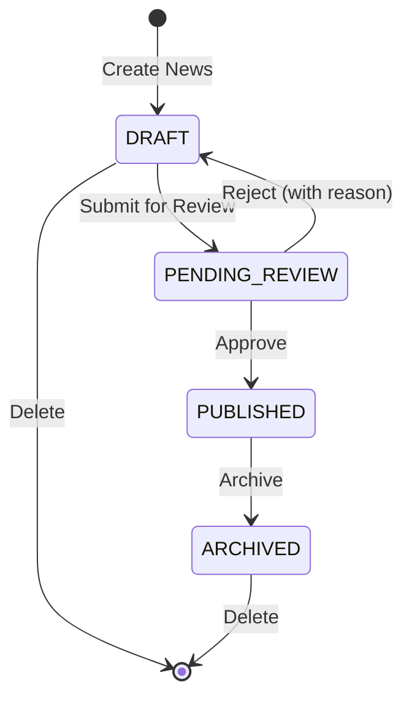

# Technical Architecture & Flow: News Feature

## 1. Folder Structure (Modular Monolith)
```text
src/
├── app/
│   ├── (admin)/news/                # Admin Console Pages
│   │   ├── page.tsx                 # List News (Data Table)
│   │   ├── [id]/page.tsx            # View/Edit/Approve News
│   │   └── create/page.tsx          # Create News Form
│   └── portal/news/                 # Public Portal Pages
│       ├── page.tsx                 # Public Listing (Filtered by PUBLISHED)
│       └── [slug]/page.tsx          # Public Read Page
├── features/news/
│   ├── _internal/
│   │   ├── actions.ts               # Server Actions (Create, Update, Publish, Delete)
│   │   ├── services.ts              # Core Business Logic & Prisma Queries
│   │   └── validations.ts           # Zod Input Validation Schemas
│   ├── server.ts                    # Public Exports for other server-side modules
│   └── index.ts                     # Public Constants, Enums, and Permissions
└── i18n/messages/
    └── news.ts                      # Translation Keys (TH/EN)
```

## 2. Route Mapping
| Path | Type | Access | Purpose |
|------|------|--------|---------|
| `/news` | Admin | `news:read` | รายการข่าวสารของ Tenant นั้น |
| `/news/create` | Admin | `news:write` | ฟอร์มสร้างข่าวสารใหม่ |
| `/news/[id]` | Admin | `news:read` | แก้ไขรายละเอียด หรือ แนบไฟล์ |
| `/portal/news` | Portal | Public | หน้ารายการข่าวสาร (Public) |
| `/portal/news/[slug]` | Portal | Public | หน้าอ่านข่าวสาร (Public) |

## 3. Data Flow Diagram (State Machine)


## 4. Permissions Definition (`src/permissions.ts`)
ต้องลงทะเบียนสิทธิ์ต่อไปนี้ในระบบส่วนกลาง:
- `news:read` (ดูรายการและอ่านข่าว)
- `news:write` (สร้าง แก้ไข แนบไฟล์)
- `news:approve` (อนุมัติเผยแพร่ / ตีกลับ)
- `news:manage` (ลบ, จัดการปักหมุด)
